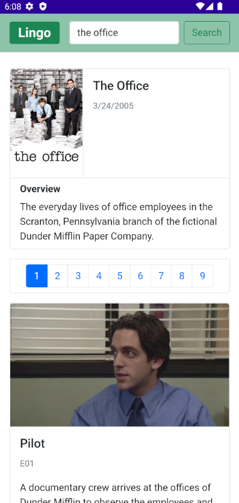
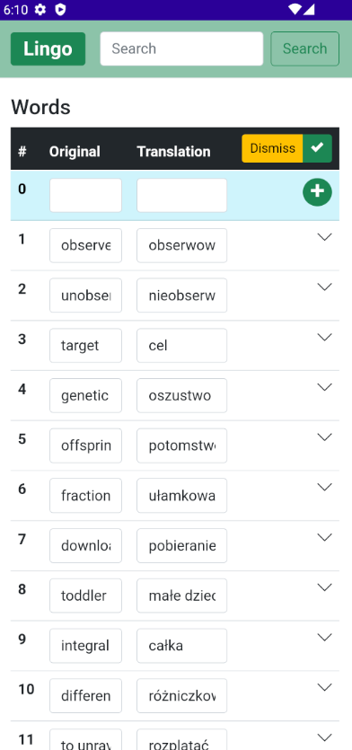
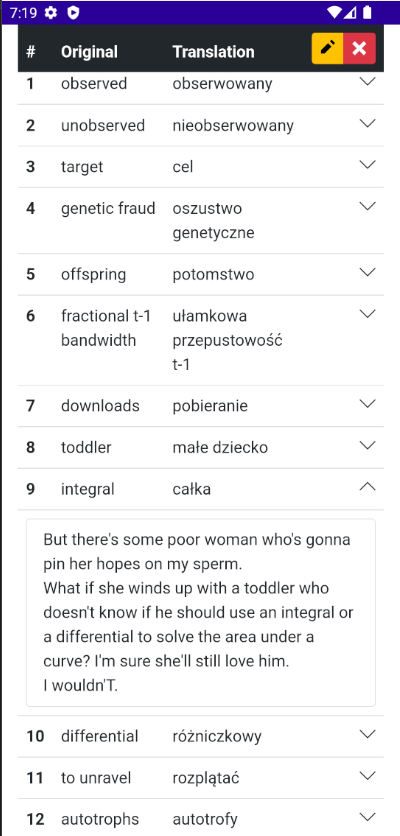

# Lingo
Lingo is a versatile cross-platform application that empowers users to explore their favorite TV shows and acquire advanced vocabulary from episodes.

## Screenshots
### Windows
Saved words are highlighted in green.


### Android





## Behind the Scenes
- **Searching Shows:** to search shows and gather additional info about series and episodes, app calls [TMDB API](https://developer.themoviedb.org/docs) 
- **Getting Subtitles:** app collects subtitles from [Open Subtitles](https://opensubtitles.stoplight.io/)
- **Extracting Words:** they are retrieved due to the kindness of ChatGPT from [OpenAI](https://platform.openai.com/docs/api-reference). It finds advanced words and translates them in the context they appear (or rather it's intended to do so)

## Data Storage
Only information about recently searched series or words extracted for a given episode are saved. Data is stored locally in a NoSQL database [LiteDB](https://www.litedb.org/).

## Multiplatform
App was tested both on **Windows 11** and **Android** Emulator Pixel 5 (API 33, Android 13.0)

## Words
You can add, edit or remove words in a table. You can also see the words in context they appear in the episode.

## Installation
Requires .NET SDK version 7.0 or higher</br>

### Configuration
#### Updating setting file
Navigate to the `LingoApp/appsettings.json` file in LingoApp project and populate it with API keys and logging info (for OpenSubtitles).

#### OpenAI model
The default model is `gpt-3.5-turbo`. You are welcome to upgrade to `gpt-4` for much better results, bearing in mind the increased cost.

#### Changing language
If you prefer different language than **Polish**, you can change it in `LingoLibrary/ApiManagers/OpenAiManager.cs` file. Find `GetWords` method and modify the context string literal.

### Visual Studio
Open
```
Lingo.sln
```
Run project
 
